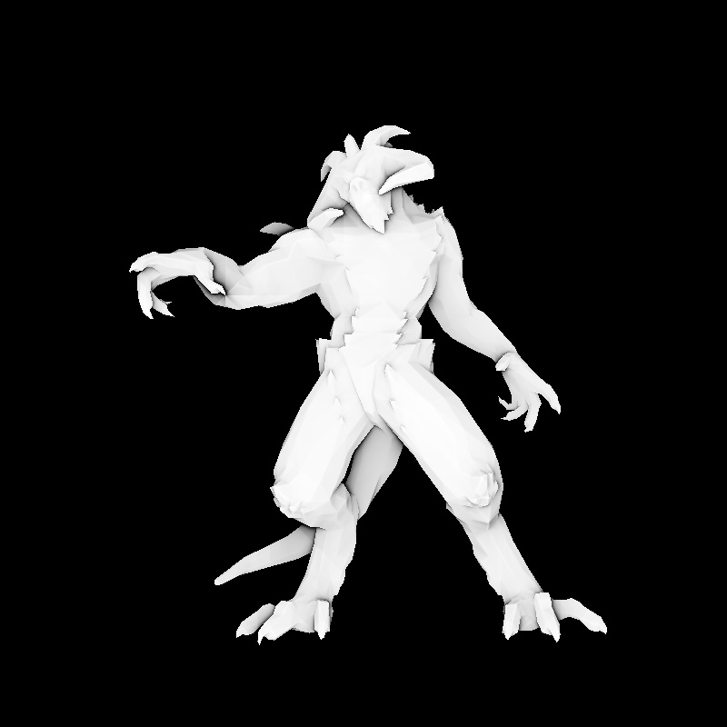

# OpencvRenderer
- Code for reimplementation [**Tiny Renderer**](https://github.com/ssloy/tinyrenderer/wiki) using Opencv
- Run faster
- Show the result while runing

# Assets
- [**Full asset files**](https://pan.baidu.com/s/1XJFvntZVBc5NU3dgJ4SMfA)

# Result
- Diablo

- African head

